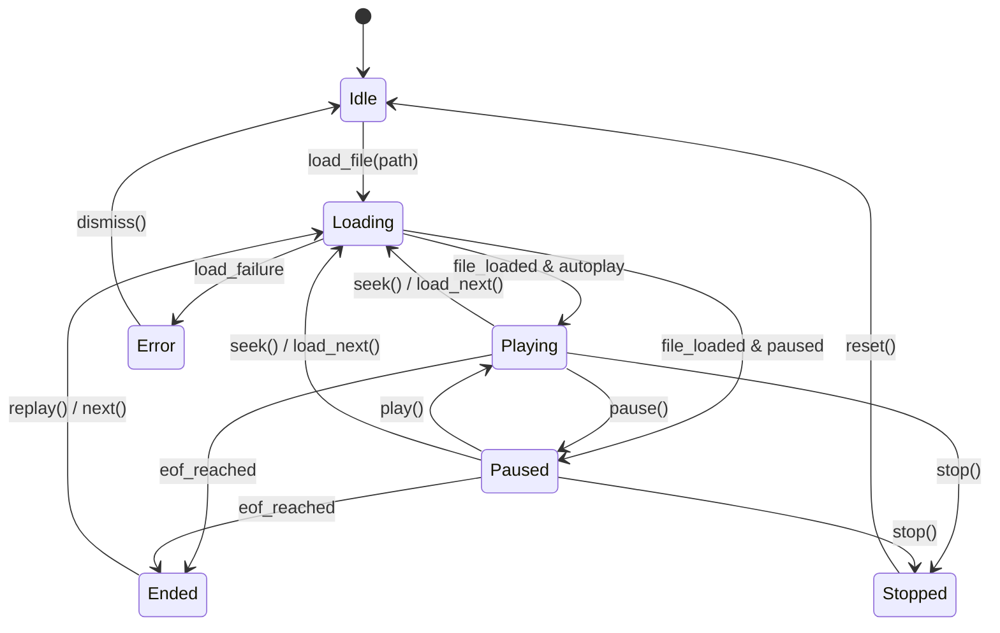

# Velo — Master Architecture & Implementation Plan

> **Document Version**: 1.0.0  
> **Status**: Proposed / Under Architectural Review  
> **Author**: Lead Software Architect  
> **Target Platforms**: macOS (Apple Silicon), Windows (x64)

---

## Table of Contents

1. [Project Goals](#1-project-goals)
2. [Non-Goals](#2-non-goals)
3. [Supported Platforms](#3-supported-platforms)
4. [Technology Decisions](#4-technology-decisions)
5. [System Architecture](#5-system-architecture)
6. [Frontend Architecture](#6-frontend-architecture)
7. [Rust Architecture](#7-rust-architecture)
8. [libmpv Integration Strategy](#8-libmpv-integration-strategy)
9. [Video Rendering Architecture](#9-video-rendering-architecture)
10. [macOS Rendering Strategy](#10-macos-rendering-strategy)
11. [Windows Rendering Strategy](#11-windows-rendering-strategy)
12. [Hardware Decoding Strategy](#12-hardware-decoding-strategy)
13. [IPC Design](#13-ipc-design)
14. [Event Architecture](#14-event-architecture)
15. [Player State Model](#15-player-state-model)
16. [Playlist Architecture](#16-playlist-architecture)
17. [Settings & Persistence](#17-settings--persistence)
18. [Error Handling](#18-error-handling)
19. [Performance Considerations](#19-performance-considerations)
20. [Security Considerations](#20-security-considerations)
21. [Dependency Strategy](#21-dependency-strategy)
22. [Licensing & Distribution](#22-licensing--distribution)
23. [Testing Strategy](#23-testing-strategy)
24. [CI/CD Strategy](#24-cicd-strategy)
25. [Packaging Strategy](#25-packaging-strategy)
26. [Repository Structure](#26-repository-structure)
27. [Implementation Phases (0 to 10)](#27-implementation-phases-0-to-10)
28. [Technical Risks & Mitigations](#28-technical-risks--mitigations)
29. [Open Questions](#29-open-questions)
30. [Definition of Done (DoD) by Phase](#30-definition-of-done-dod-by-phase)

---

## 1. Project Goals

Velo is designed as a modern, ultra-fast, lightweight, open-source desktop video player for macOS and Windows.

* **Sub-500ms Cold Startup**: Rapid initialization from process spawn to interactive UI.
* **Low Memory Footprint**: < 80MB idle, ~150MB active 4K playback.
* **Zero-Copy Native Video Rendering**: Hardware-accelerated decoding and direct GPU presentation without intermediate frame copies or IPC serialization.
* **Flawless Codec & Subtitle Compatibility**: Comprehensive format support (MP4, MKV, MOV, AVI, WebM; H.264, HEVC/H.265, AV1, VP9) and pixel-perfect subtitle rendering (ASS/SSA, SRT, VTT, embedded/external) powered by `libmpv` and `libass`.
* **Modern Desktop UX**: Sleek, distraction-free interface with auto-fading overlay controls, dark/light themes, keyboard shortcuts, and smooth animations.
* **Reliability & Stability**: Strict error typing, zero-panic Rust backend, decoupled state management, and resilient error recovery.
* **Open Source Contributor-Friendly**: Modular codebase, comprehensive documentation, strict typing, automated CI, and straightforward build steps.

---

## 2. Non-Goals

To maintain high performance and simplicity, the following are explicitly out of scope:

* **Media Server Ecosystem / Streaming Catalog**: Velo is a local media player, not a Plex, Emby, or Jellyfin server/client.
* **Video Editing / Transcoding**: Velo will not include video re-encoding, trimming, filtering, or conversion tools.
* **Electron Runtime**: Velo will never use Electron due to memory overhead and binary bloat.
* **HTML5 `<video>` / WebCodecs Frame Blitting**: Velo will not decode frames to JavaScript/Canvas or push raw video frames across Tauri IPC.
* **P2P / Torrent Ingestion**: Velo will not bundle torrent engines or unauthorized streaming scrapers.

---

## 3. Supported Platforms

| Platform | Architecture | OS Version | Tier | Priority |
| :--- | :--- | :--- | :--- | :--- |
| **macOS** | Apple Silicon (`aarch64-apple-darwin`) | macOS 12 (Monterey) or later | Tier 1 | Release Blocker |
| **Windows** | x64 (`x86_64-pc-windows-msvc`) | Windows 10 / 11 64-bit | Tier 1 | Release Blocker |
| **macOS** | Intel (`x86_64-apple-darwin`) | macOS 12 or later | Tier 2 | Post-V1 Target |
| **Linux** | x86_64 (Wayland / X11) | Modern glibc Linux distributions | Tier 3 | Future Consideration |

---

## 4. Technology Decisions

### Architectural Decision Records (ADRs)

#### ADR-01: Application Framework — Tauri v2
* **Decision**: Use **Tauri v2** over Electron and Qt.
* **Reason**: Tauri utilizes the operating system's native webview (WKWebView on macOS, WebView2 on Windows) and a native Rust backend. This yields a sub-15MB binary, low memory footprint, and direct access to native OS APIs and C dynamic libraries (`libmpv`).
* **Alternatives Considered**: 
  * *Electron*: High memory overhead (150MB+ idle), heavy binary (>100MB), complex multi-process video frame plumbing.
  * *Qt 6 / QML*: Fast native performance, but slower UI iteration, complex cross-platform styling, and heavy C++ toolchain requirements for open-source contributors.
  * *Flutter Desktop*: Immature multi-window and C video embedding ecosystem on macOS/Windows.
* **Trade-offs**: Requires platform-specific native child window/view hierarchy manipulation to place native video surfaces underneath transparent webviews.

#### ADR-02: Video Playback Engine — libmpv
* **Decision**: Integrate `libmpv` as a shared dynamic library (`.dylib` on macOS, `.dll` on Windows) linked to the Rust backend.
* **Reason**: `libmpv` offers world-class demuxing, decoding (via FFmpeg), audio/video synchronization, subtitle rendering (`libass`), and GPU presentation pipelines (`vo=gpu-next`).
* **Alternatives Considered**:
  * *libVLC*: Heavier runtime footprint, less flexible subtitle styling, and less configurable `vo` rendering parameters.
  * *Custom FFmpeg + WGPU pipeline*: Extreme engineering complexity to replicate A/V sync, format demuxing, tone mapping, and subtitle layout engines.
* **Trade-offs**: Native library distribution, dynamic linking, and cross-platform build toolchain setup require careful packaging.

#### ADR-03: Frontend Architecture — Vue 3 + TypeScript + Vite + Pinia
* **Decision**: Build the UI layer with **Vue 3** (Composition API, `<script setup>`), **TypeScript** (Strict mode), **Vite**, and **Pinia**.
* **Reason**: Vue 3's reactive proxy model provides high UI responsiveness without React's virtual DOM re-render overhead. Pinia offers a type-safe, lightweight store architecture for player and playlist state.
* **Alternatives Considered**:
  * *React*: Higher re-render frequency and state overhead during rapid timeline updates.
  * *Svelte*: Compact output, but smaller desktop-focused UI component ecosystem.
* **Trade-offs**: Custom desktop controls and draggable title bars must be explicitly wired through CSS and Tauri window APIs.

#### ADR-04: Styling & UI Components — Tailwind CSS + Scoped CSS + Lucide Icons
* **Decision**: Use **Tailwind CSS** with scoped component styles and **lucide-vue-next** for vector icons.
* **Reason**: Zero runtime CSS overhead, atomic utility classes, seamless dark/light theme switching via CSS variables, and crisp SVG iconography.

---

## 5. System Architecture

Velo uses a **Layered Hybrid Architecture**: a platform-native GPU rendering surface sits directly underneath a transparent webview UI layer, coordinated by a high-performance Rust service.

```
┌────────────────────────────────────────────────────────────────────────┐
│                          Vue 3 Overlay UI                              │
│  [TopBar / Controls]   [Timeline Slider]   [Modals / Toasts / Drawers] │
│  (CSS: background: transparent; pointer-events: none on video zone)    │
└───────────────────────────────────┬────────────────────────────────────┘
                                    │ Tauri IPC (Commands & Events)
┌───────────────────────────────────▼────────────────────────────────────┐
│                         Tauri Rust Backend                             │
│  ┌───────────────────┐  ┌────────────────────┐  ┌───────────────────┐  │
│  │  Command Handlers │  │   Player Manager   │  │   Settings Store  │  │
│  └─────────┬─────────┘  └──────────┬─────────┘  └───────────────────┘  │
│            │                       │                                   │
│            │              ┌────────▼────────┐                          │
│            │              │ Dedicated Event │                          │
│            │              │   Loop Thread   │                          │
│            │              └────────┬────────┘                          │
│            ▼                       ▼                                   │
│  ┌───────────────────────────────────────────┐                         │
│  │         Safe Rust libmpv Wrapper          │                         │
│  └─────────────────────┬─────────────────────┘                         │
└────────────────────────┼───────────────────────────────────────────────┘
                         │ Native C API / Window Handle (wid)
┌────────────────────────▼───────────────────────────────────────────────┐
│                           libmpv Engine                                │
│  ┌───────────────┐  ┌─────────────────────────┐  ┌──────────────────┐  │
│  │ FFmpeg Demux  │  │  VideoToolbox / D3D11VA │  │ libass Subtitles │  │
│  └───────────────┘  └────────────┬────────────┘  └──────────────────┘  │
│                                  ▼                                     │
│                     GPU Video Output (vo=gpu-next)                     │
└──────────────────────────────────┬─────────────────────────────────────┘
                                   │ Direct Presentation
┌──────────────────────────────────▼─────────────────────────────────────┐
│                       Native OS Rendering Surface                      │
│        macOS: NSView / CALayer         Windows: Child HWND (Direct3D)  │
└────────────────────────────────────────────────────────────────────────┘
```

---

## 6. Frontend Architecture

### Directory Structure
```
src/
├── assets/                 # SVGs, base CSS, fonts
│   └── styles/
│       ├── main.css        # Tailwind base & global transparency rules
│       ├── theme.css       # Light/Dark CSS custom properties
│       └── transitions.css # Smooth fade/slide animations
├── components/
│   ├── common/             # Reusable UI primitives
│   │   ├── IconButton.vue
│   │   ├── Modal.vue
│   │   ├── Slider.vue
│   │   ├── Toast.vue
│   │   └── Tooltip.vue
│   ├── player/             # Video player UI
│   │   ├── AudioTrackSelector.vue
│   │   ├── ControlOverlay.vue
│   │   ├── MediaInfoModal.vue
│   │   ├── SpeedSelector.vue
│   │   ├── SubtitleTrackSelector.vue
│   │   ├── TimelineBar.vue
│   │   ├── TopBar.vue
│   │   └── VolumeControl.vue
│   ├── playlist/           # Playlist components
│   │   ├── PlaylistDrawer.vue
│   │   └── PlaylistItem.vue
│   └── settings/           # Settings panels
│       ├── AudioSettings.vue
│       ├── GeneralSettings.vue
│       ├── SettingsModal.vue
│       ├── SubtitleSettings.vue
│       └── VideoSettings.vue
├── composables/            # Reusable business logic & state hooks
│   ├── useAutoHideControls.ts
│   ├── useDragAndDrop.ts
│   ├── useFullscreen.ts
│   ├── useKeyboardShortcuts.ts
│   ├── usePlayer.ts
│   ├── usePlaylist.ts
│   ├── useSettings.ts
│   └── useToast.ts
├── services/               # Tauri IPC communication bridges
│   ├── playerService.ts
│   ├── playlistService.ts
│   ├── settingsService.ts
│   └── shortcutRegistry.ts
├── stores/                 # Pinia reactive state stores
│   ├── playerStore.ts
│   ├── playlistStore.ts
│   ├── settingsStore.ts
│   └── uiStore.ts
├── types/                  # TypeScript interface declarations
│   ├── events.ts
│   ├── player.ts
│   ├── playlist.ts
│   └── settings.ts
├── utils/                  # Pure utility functions
│   ├── constants.ts
│   ├── formatters.ts
│   └── time.ts
├── App.vue                 # Root application component
└── main.ts                 # Vue application entry point
```

### Overlay Transparency & Mouse Interaction Model
* **Transparent Webview Base**: The `html`, `body`, and `#app` elements are set to `background: transparent;`.
* **Pointer Events Strategy**:
  * The root overlay container defaults to `pointer-events: none;`.
  * Interactive UI controls (TopBar, Bottom Control Bar, Timeline, Modals, Drawers) have `pointer-events: auto;`.
  * Click/drag gestures on the empty video area are captured by an invisible click handler that dispatches play/pause, double-click fullscreen, and window-dragging commands to Rust.
* **Auto-Hiding Controls (`useAutoHideControls`)**:
  * An inactivity timer (default 2500ms) tracks `mousemove`, `mousedown`, and `keydown`.
  * While playing, the control bar and cursor fade out (`opacity: 0; cursor: none;`).
  * On mouse movement or when paused, controls immediately restore opacity.

---

## 7. Rust Architecture

### Module Hierarchy
```
src-tauri/src/
├── commands/               # Tauri IPC command entry points
│   ├── mod.rs
│   ├── player.rs           # Play, pause, seek, load, volume, speed
│   ├── playlist.rs         # Playlist operations & queue management
│   ├── settings.rs         # Persistent settings reads/writes
│   └── tracks.rs           # Audio & subtitle track selection
├── errors/                 # Centralized typed error definitions
│   ├── mod.rs
│   ├── player_error.rs
│   └── storage_error.rs
├── platform/               # OS-specific native view & power management
│   ├── mod.rs
│   ├── macos.rs            # NSView hierarchy, sleep assertion
│   └── windows.rs          # Child HWND, SetThreadExecutionState
├── player/                 # Core libmpv abstraction & management
│   ├── mod.rs
│   ├── core.rs             # Safe wrapper around libmpv C pointers
│   ├── events.rs           # Background event listener thread
│   ├── manager.rs          # PlayerManager facade & synchronization
│   ├── properties.rs       # Type-safe mpv property observation
│   └── types.rs            # Rust structs mapped to IPC payloads
├── storage/                # App data persistence (JSON/Atomic write)
│   ├── mod.rs
│   ├── history_store.rs    # Recent files & resume timestamps
│   └── settings_store.rs   # Persistent user preferences
├── lib.rs                  # Tauri builder setup & state injection
└── main.rs                 # Native binary entry point
```

### Threading & Concurrency Model
* **Main UI Thread**: Runs the Tauri window event loop and WebView message dispatcher.
* **`PlayerManager`**: Wrapped in `tauri::State<Arc<PlayerManager>>`. Uses internal `parking_lot::Mutex` or `std::sync::RwLock` for fast, non-blocking state access.
* **Dedicated MPV Event Thread**:
  * Spawns an isolated OS thread via `std::thread::Builder::new().name("velo-mpv-events")`.
  * Calls `mpv_wait_event(mpv_handle, 0.25)` in an infinite loop.
  * Translates raw C events into typed Rust structs and emits them asynchronously to the frontend via `AppHandle::emit`.
  * Offloads heavy processing from both the Tauri main thread and mpv's internal rendering thread.

---

## 8. libmpv Integration Strategy

### Safe Rust Wrapper Design
Direct calls to raw `libmpv` C functions are strictly encapsulated inside `player/core.rs`. No raw C pointers (`*mut mpv_handle`) are exposed outside this boundary.

```rust
pub struct MpvCore {
    handle: *mut mpv_handle,
}

unsafe impl Send for MpvCore {}
unsafe impl Sync for MpvCore {}
```

### Property Observation
Instead of polling mpv for playback position and state, Velo leverages `mpv_observe_property`:

| mpv Property | Format | Rust Event Target | Throttling |
| :--- | :--- | :--- | :--- |
| `pause` | `MPV_FORMAT_FLAG` | `velo://player-state` | Immediate |
| `time-pos` | `MPV_FORMAT_DOUBLE` | `velo://time-update` | Throttled (10Hz / 100ms) |
| `duration` | `MPV_FORMAT_DOUBLE` | `velo://media-loaded` | Immediate |
| `volume` | `MPV_FORMAT_DOUBLE` | `velo://volume-changed` | Immediate |
| `mute` | `MPV_FORMAT_FLAG` | `velo://volume-changed` | Immediate |
| `speed` | `MPV_FORMAT_DOUBLE` | `velo://speed-changed` | Immediate |
| `track-list` | `MPV_FORMAT_NODE` | `velo://tracks-changed` | Immediate |
| `eof-reached` | `MPV_FORMAT_FLAG` | `velo://playback-ended` | Immediate |

### Command Dispatch
All playback actions are dispatched via `mpv_command_async` or safe synchronous wrappers with strict error checks:
* `loadfile <url> replace`
* `seek <seconds> relative+exact`
* `set pause <yes/no>`
* `set volume <0-100>`
* `set speed <0.25-2.0>`
* `sub-add <path> select`

---

## 9. Video Rendering Architecture

### Evaluation of Rendering Strategies

```
┌────────────────────────────────────────────────────────────────────────┐
│                    Video Rendering Approaches Compared                 │
├────────────────────────────┬───────────────────────────────────────────┤
│ Approach                   │ Verdict & Technical Assessment            │
├────────────────────────────┼───────────────────────────────────────────┤
│ 1. Frame Copy via IPC      │ REJECTED. Copying 4K 60fps 10-bit YUV     │
│    (mpv -> Rust -> IPC     │ to JS/Canvas consumes ~1.5GB/s bandwidth, │
│     -> Canvas/WebGL)       │ causing high CPU/RAM load & dropped frames│
├────────────────────────────┼───────────────────────────────────────────┤
│ 2. mpv_render_context      │ ACCEPTABLE, but requires writing a custom │
│    with Metal/Direct3D FBO │ swapchain, vsync loop, and window resize  │
│                            │ synchronization in Rust.                  │
├────────────────────────────┼───────────────────────────────────────────┤
│ 3. Native Child Surface    │ SELECTED (RECOMMENDED). Creates a native  │
│    Underlay (wid)          │ child window/view behind the transparent  │
│                            │ WebView. mpv manages its own optimized    │
│                            │ swapchain, vsync, and hardware overlays.  │
└────────────────────────────┴───────────────────────────────────────────┘
```

### The Chosen Strategy: Native Child Surface Underlay (`wid`)
1. During window initialization in Rust, a native child view (`NSView` on macOS, child `HWND` on Windows) is instantiated.
2. The child view is placed at index 0 (beneath the WebView) in the native window's view hierarchy and pinned to fill the entire client area.
3. The native handle (pointer / integer) is passed to `libmpv` using the `wid` option.
4. `libmpv` initializes its native GPU rendering swapchain (`vo=gpu-next`) directly into this surface.
5. The Tauri WebView sits on top with transparency enabled, displaying controls, menus, and subtitles when needed, while the video renders at full native refresh rates with zero IPC overhead.

---

## 10. macOS Rendering Strategy

```
┌────────────────────────────────────────────────────────┐
│               macOS Window View Hierarchy              │
├────────────────────────────────────────────────────────┤
│  NSWindow (Tauri Main Window)                          │
│   └── contentView (NSView)                             │
│        ├── Child Video NSView (libmpv wid) [Layer 0]   │
│        │    └── CALayer / CAMetalLayer (Direct Metal)  │
│        └── WKWebView (Tauri UI Overlay)    [Layer 1]   │
│             └── drawsBackground = NO (Transparent)     │
└────────────────────────────────────────────────────────┘
```

### Implementation Details:
* **Window Configuration**: `transparent: true`, `decorations: false` (or custom title bar with standard macOS traffic light buttons).
* **WKWebView Setup**: Set `drawsBackground = NO` via Cocoa Objective-C / `objc2` bindings in `platform/macos.rs`.
* **Hardware Decoding**: `hwdec=videotoolbox` (zero-copy hardware decoding to Apple Silicon GPU textures).
* **Resize Handling**: The child `NSView` is configured with `NSViewWidthSizable | NSViewHeightSizable` autoresizing mask so resizing the main window automatically adjusts the video view with zero lag.
* **Sleep Prevention**: Use macOS `IOPMAssertionCreateWithName(kIOPMAssertionTypeNoDisplaySleep, ...)` when playback is active; release assertion when paused or stopped.

---

## 11. Windows Rendering Strategy

```
┌────────────────────────────────────────────────────────┐
│              Windows HWND View Hierarchy               │
├────────────────────────────────────────────────────────┤
│  Main Parent HWND (Tauri Window)                       │
│   ├── Child HWND (libmpv wid) [WS_CHILD | WS_VISIBLE]  │
│   │    └── Direct3D 11 Swapchain (D3D11VA / Zero-Copy) │
│   └── WebView2 Controller (Tauri UI)                   │
│        └── DefaultBackgroundColor = 0x00000000 (Trans) │
└────────────────────────────────────────────────────────┘
```

### Implementation Details:
* **Child HWND Creation**: Create a native Win32 child window using `CreateWindowExW` with `WS_CHILD | WS_VISIBLE | WS_CLIPSIBLINGS`.
* **WebView2 Transparency**: Configure `ICoreWebView2Controller2::put_DefaultBackgroundColor(COREWEBVIEW2_COLOR{0, 0, 0, 0})`.
* **Hardware Decoding**: `hwdec=d3d11va` with fallback to `dxva2`.
* **Window Resizing**: Intercept parent window `WM_SIZE` messages or use Win32 `SetWindowPos` to keep the child HWND synchronized with the client rect.
* **DPI Awareness**: Set `Per-Monitor V2 DPI awareness` in Tauri manifest to prevent scaling blur on multi-monitor setups.
* **Sleep Prevention**: Call `SetThreadExecutionState(ES_CONTINUOUS | ES_DISPLAY_REQUIRED | ES_SYSTEM_REQUIRED)` during playback.

---

## 12. Hardware Decoding Strategy

### Configuration Defaults
```ini
# Default mpv configuration for Velo
vo=gpu-next
gpu-api=auto
hwdec=auto-safe
hwdec-codecs=all
target-colorspace-hint=yes
tone-mapping=auto
dither-depth=auto
```

### Platform Hardware Decoder Matrix
* **macOS (Apple Silicon)**: `videotoolbox` (Hardware decoders for H.264, HEVC 8/10-bit, ProRes, AV1 on M3/M4).
* **Windows (x64)**: `d3d11va` (DirectX Video Acceleration on NVIDIA, AMD, and Intel GPUs), with automatic fallback to `dxva2` or software decoding (`no`) for unsupported legacy formats.

---

## 13. IPC Design

### Tauri Commands (Frontend -> Rust)

```typescript
// Player Commands
player_load_file(path: string, startTime?: number): Promise<void>
player_play(): Promise<void>
player_pause(): Promise<void>
player_toggle_play(): Promise<void>
player_stop(): Promise<void>
player_seek(seconds: number, exact: boolean): Promise<void>
player_set_volume(volume: number): Promise<void>
player_set_mute(muted: boolean): Promise<void>
player_set_speed(speed: number): Promise<void>
player_set_aspect_ratio(ratio: string): Promise<void>

// Track Commands
player_select_audio_track(trackId: number): Promise<void>
player_select_subtitle_track(trackId: number): Promise<void>
player_add_external_subtitle(path: string): Promise<void>
player_set_subtitle_delay(seconds: number): Promise<void>
player_set_audio_delay(seconds: number): Promise<void>

// Playlist Commands
playlist_add_items(paths: string[]): Promise<void>
playlist_remove_item(id: string): Promise<void>
playlist_clear(): Promise<void>
playlist_move_item(fromIndex: number, toIndex: number): Promise<void>
playlist_play_index(index: number): Promise<void>
playlist_next(): Promise<void>
playlist_previous(): Promise<void>

// Settings Commands
settings_get_all(): Promise<AppSettings>
settings_update(settings: Partial<AppSettings>): Promise<void>
settings_reset(): Promise<AppSettings>
```

---

## 14. Event Architecture

### Tauri Events (Rust -> Frontend Broadcast)

```typescript
// Event: "velo://player-state"
interface PlayerStateEvent {
  state: 'idle' | 'loading' | 'playing' | 'paused' | 'stopped' | 'ended' | 'error';
}

// Event: "velo://time-update" (Throttled to 10Hz)
interface TimeUpdateEvent {
  currentTime: number;
  duration: number;
  bufferPercent: number;
}

// Event: "velo://media-loaded"
interface MediaLoadedEvent {
  filePath: string;
  fileName: string;
  duration: number;
  width: number;
  height: number;
  videoCodec: string;
  audioCodec: string;
  chapters: Chapter[];
}

// Event: "velo://tracks-changed"
interface TracksChangedEvent {
  audioTracks: Track[];
  subtitleTracks: Track[];
  selectedAudioId: number;
  selectedSubtitleId: number;
}

// Event: "velo://volume-changed"
interface VolumeChangedEvent {
  volume: number;
  muted: boolean;
}

// Event: "velo://speed-changed"
interface SpeedChangedEvent {
  speed: number;
}

// Event: "velo://error"
interface PlayerErrorEvent {
  code: string;
  message: string;
  recoverable: boolean;
}
```

---

## 15. Player State Model

### State Transition Diagram



### Source of Truth Allocation
* **libmpv (Authoritative)**: Video time, duration, track availability, playback status, hardware decode status.
* **Rust Backend (Authoritative)**: Active playlist queue, persistence manager, native window handles.
* **Pinia Frontend (Authoritative)**: UI overlay visibility, modal open states, active theme, transient slider drag values.

---

## 16. Playlist Architecture

### Domain Model
```typescript
interface PlaylistItem {
  id: string;             // UUID v4
  path: string;           // Absolute filesystem path
  fileName: string;       // Basename (e.g., "Movie.mkv")
  duration: number;       // In seconds (0 if unprobed)
  lastPosition?: number;  // Resume timestamp
  thumbnail?: string;     // Optional cache key
}

interface PlaylistState {
  items: PlaylistItem[];
  currentIndex: number;
  loopMode: 'off' | 'all' | 'single';
  shuffle: boolean;
  autoPlayNext: boolean;
}
```

### Features:
* **Folder Ingestion**: Recursively scans dropped directories for supported media extensions (`.mp4`, `.mkv`, `.mov`, `.avi`, `.webm`, `.flv`, `.m4v`, `.ts`, `.wmv`).
* **Drag-and-Drop Reordering**: Smooth UI drag reordering updating the internal Rust queue.
* **Auto-Play Next**: Listens for `velo://playback-ended` and automatically advances to `currentIndex + 1` (or loops if enabled).

---

## 17. Settings & Persistence

### Storage Schema (`settings.json`)
```json
{
  "version": 1,
  "general": {
    "theme": "dark",
    "language": "en",
    "rememberPlaybackPosition": true,
    "autoPlayNext": true
  },
  "video": {
    "hardwareAcceleration": true,
    "defaultAspectRatio": "auto",
    "toneMapping": "auto"
  },
  "audio": {
    "defaultVolume": 80,
    "preferredLanguage": "eng",
    "volumeStep": 5,
    "audioDelayStep": 0.1
  },
  "subtitle": {
    "preferredLanguage": "eng",
    "autoLoadExternal": true,
    "fontSize": 48,
    "subtitleDelayStep": 0.1
  },
  "advanced": {
    "mpvLog": "warn",
    "customMpvFlags": []
  }
}
```

### Storage Location
* **macOS**: `~/Library/Application Support/velo/`
* **Windows**: `%APPDATA%\velo\`
* **Atomic Writes**: Written to `.tmp` file and atomically renamed to prevent file corruption on unexpected crashes.

---

## 18. Error Handling

### Rust Error Hierarchy (`thiserror`)
```rust
#[derive(thiserror::Error, Debug, serde::Serialize)]
#[serde(tag = "type", content = "details")]
pub enum VeloError {
    #[error("Player engine error: {0}")]
    Player(#[from] PlayerError),

    #[error("Platform error: {0}")]
    Platform(#[from] PlatformError),

    #[error("Storage error: {0}")]
    Storage(#[from] StorageError),

    #[error("File not found: {0}")]
    FileNotFound(String),

    #[error("Unsupported media format: {0}")]
    UnsupportedMedia(String),
}

#[derive(thiserror::Error, Debug, serde::Serialize)]
pub enum PlayerError {
    #[error("Failed to initialize libmpv context")]
    InitFailed,
    #[error("mpv C API returned error code: {0}")]
    MpvApi(i32),
    #[error("Track not found: {0}")]
    TrackNotFound(i32),
}
```

### Frontend Error Presentation
* Recoverable errors (e.g., subtitle file failed to load) display non-intrusive toast notifications.
* Critical errors (e.g., corrupted media file) update the player state to `error` with a user-friendly recovery view.
* Production Rust code strictly forbids `.unwrap()` and `.expect()` without documented invariants, enforced by `#![warn(clippy::unwrap_used)]`.

---

## 19. Performance Considerations

1. **Zero IPC Frame Streaming**: Video is rendered exclusively via native GPU surfaces (`wid`).
2. **IPC Rate Limiting**: Position events (`velo://time-update`) are capped at 10Hz (100ms interval).
3. **Decoupled Timeline Scrubbing**: When the user drags the timeline slider, the UI updates locally via CSS/computed values; `player_seek` commands are debounced to 30ms to prevent thrashing mpv's keyframe demuxer.
4. **Vue Reactivity Optimization**: Use `shallowRef` for large track lists and chapter arrays to avoid unnecessary deep proxy observation.
5. **Auto-Hiding Webview Overlays**: When controls hide, the entire Webview is transparent and static, reducing compositor GPU work to near zero during playback.

---

## 20. Security Considerations

* **Tauri Content Security Policy (CSP)**: Strict CSP allowing only local assets and IPC:
  `default-src 'self'; img-src 'self' data:; style-src 'self' 'unsafe-inline';`
* **Filesystem Isolation**: Scope Tauri filesystem access strictly to user-selected files and the application config directory.
* **Malicious File Sanitization**: libmpv runs with network streaming disabled unless explicitly opened via URL; local script execution in mpv (`--load-scripts=no`) is disabled by default.

---

## 21. Dependency Strategy

### Rust Dependencies (`Cargo.toml`)
* `tauri = "^2.0"` (Desktop framework)
* `libmpv-sys` or custom FFI wrapper (C bindings to libmpv)
* `serde = { version = "1.0", features = ["derive"] }` (Serialization)
* `serde_json = "1.0"` (JSON persistence)
* `tokio = { version = "1.0", features = ["sync", "rt"] }` (Async runtime)
* `thiserror = "1.0"` (Error derive)
* `parking_lot = "0.12"` (Fast synchronization primitives)
* `tracing = "0.1"` / `tracing-subscriber = "0.3"` (Structured logging)
* `raw-window-handle = "0.6"` (Native window handle extraction)
* Platform-specific:
  * `[target.'cfg(target_os = "macos")'.dependencies]`: `objc2`, `cocoa`
  * `[target.'cfg(target_os = "windows")'.dependencies]`: `windows-sys`

### Frontend Dependencies (`package.json`)
* `vue = "^3.5"` (Reactive UI core)
* `pinia = "^2.2"` (State management)
* `lucide-vue-next = "^0.400"` (Icons)
* `tailwindcss = "^3.4"`, `postcss`, `autoprefixer` (Styling)
* Dev dependencies:
  * `typescript = "^5.5"`
  * `vite = "^5.4"`
  * `@vitejs/plugin-vue = "^5.1"`
  * `vitest = "^2.0"`
  * `eslint = "^9.0"`, `prettier = "^3.0"`

---

## 22. Licensing & Distribution

### Legal & Licensing Analysis
* **Velo Core Codebase**: Licensed under **GPL-3.0** (or MIT with a GPL-3.0 distribution addendum).
* **`libmpv` & `FFmpeg` Dependency Analysis**:
  * `libmpv` is licensed under **LGPL-2.1-or-later** in its minimal configuration (`-Dgpl=false`).
  * However, standard high-performance builds of `libmpv` and `FFmpeg` incorporate GPL-licensed decoders, filters, and optimizations.
  * When Velo distributes pre-compiled binaries bundling `libmpv` and `FFmpeg`, the resulting combined binary distribution is governed by the **GNU General Public License v3.0 (GPL-3.0)**.
* **Binary Distribution Checklist**:
  * Include the full text of GPL-3.0 in binary releases.
  * Provide access to the exact source code and build scripts used to compile the bundled `libmpv` and `FFmpeg` binaries.
  * Allow end users to swap the bundled `libmpv` dynamic library (`.dylib` / `.dll`) with their own build.

---

## 23. Testing Strategy

### 1. Frontend Unit & Store Tests (Vitest)
* `tests/unit/stores/playerStore.test.ts`: Verify state transitions (`idle` -> `playing` -> `paused`).
* `tests/unit/stores/playlistStore.test.ts`: Verify queue reordering, loop modes, and auto-advance.
* `tests/unit/utils/formatters.test.ts`: Verify timestamp formatting (`hh:mm:ss`, `mm:ss`).
* `tests/unit/composables/useKeyboardShortcuts.test.ts`: Verify shortcut dispatches.

### 2. Rust Backend Tests (`cargo test`)
* `player::properties`: Test parsing and serialization of mpv property nodes.
* `playlist::queue`: Test queue navigation, shuffle algorithms, and boundary conditions.
* `storage::settings`: Test JSON serialization, fallback defaults, and schema migration.

### 3. Mock mpv Test Harness (Headless CI)
* Provide a `MockMpvCore` implementation that simulates mpv property changes and events in headless environments (GitHub Actions runners without physical GPUs).

---

## 24. CI/CD Strategy

### GitHub Actions Workflow Matrix

```yaml
# .github/workflows/ci.yml
name: CI
on: [push, pull_request]

jobs:
  frontend-check:
    runs-on: ubuntu-latest
    steps:
      - uses: actions/checkout@v4
      - uses: actions/setup-node@v4
        with:
          node-version: 20
          cache: 'npm'
      - run: npm ci
      - run: npm run lint
      - run: npm run typecheck
      - run: npm run test

  rust-check:
    strategy:
      matrix:
        os: [macos-14, windows-latest]
    runs-on: ${{ matrix.os }}
    steps:
      - uses: actions/checkout@v4
      - uses: dtolnay/rust-toolchain@stable
        with:
          components: clippy, rustfmt
      - run: cargo fmt --check
      - run: cargo clippy -- -D warnings
      - run: cargo test
```

### Release Pipeline:
* Automatic build of `.dmg` (macOS Apple Silicon) and `.msi` / `.exe` (Windows x64) upon Git tag creation (`v*.*.*`).
* Documented hooks for Apple Developer ID code signing, `notarytool` notarization, and Windows Authenticode signing.

---

## 25. Packaging Strategy

* **macOS**: Bundle `libmpv.2.dylib` and dependent dylibs inside `Velo.app/Contents/Frameworks/`, configured with `@rpath/libmpv.2.dylib`.
* **Windows**: Bundle `libmpv-2.dll` and dependent FFmpeg DLLs in the application root next to `velo.exe`.
* **Tauri Config**: Leverage Tauri's `bundle.resources` to automatically copy native libraries into installer packages.

---

## 26. Repository Structure

```
velo/
├── .github/
│   ├── ISSUE_TEMPLATE/
│   │   ├── bug_report.md
│   │   └── feature_request.md
│   ├── PULL_REQUEST_TEMPLATE.md
│   └── workflows/
│       ├── ci.yml
│       └── release.yml
├── docs/
│   ├── architecture.md
│   ├── build_instructions.md
│   └── keyboard_shortcuts.md
├── src/                    # Vue 3 Frontend Source
├── src-tauri/              # Rust & Tauri Backend Source
│   ├── binaries/           # Platform native precompiled libmpv libraries
│   │   ├── aarch64-apple-darwin/
│   │   └── x86_64-pc-windows-msvc/
│   ├── src/
│   ├── Cargo.toml
│   └── tauri.conf.json
├── tests/                  # Integration & Frontend Unit Tests
├── .editorconfig
├── .gitignore
├── .prettierrc
├── eslint.config.js
├── index.html
├── package.json
├── tsconfig.json
├── vite.config.ts
├── CODE_OF_CONDUCT.md
├── CONTRIBUTING.md
├── LICENSE
├── PLAN.md
├── README.md
└── SECURITY.md
```

---

## 27. Implementation Phases (0 to 10)

```
┌─────────┐     ┌─────────┐     ┌─────────┐     ┌─────────┐     ┌─────────┐
│ Phase 0 │ ──> │ Phase 1 │ ──> │ Phase 2 │ ──> │ Phase 3 │ ──> │ Phase 4 │
│ Tech    │     │ Found-  │     │ Playback│     │ Core    │     │ Media   │
│ Validate│     │ ation   │     │ PoC     │     │ Player  │     │ Features│
└─────────┘     └─────────┘     └─────────┘     └─────────┘     └─────────┘
                                                                     │
┌─────────┐     ┌─────────┐     ┌─────────┐     ┌─────────┐     ┌────▼────┐
│ Phase 10│ <── │ Phase 9 │ <── │ Phase 8 │ <── │ Phase 7 │ <── │ Phase 5 │
│ Release │     │ Package │     │ Platform│     │ UX &    │     │ Playlist│
│ Prep    │     │ & Sign  │     │ Optimize│     │ Polish  │     │ & Queue │
└─────────┘     └─────────┘     └─────────┘     └─────────┘     └─────────┘
```

* **Phase 0 — Technical Validation**: Validate libmpv C bindings, native child view creation on macOS/Windows, transparent webview integration, and hardware acceleration defaults.
* **Phase 1 — Application Foundation**: Scaffold Tauri v2 + Vue 3 + TypeScript + Tailwind CSS project, establish ESLint/Prettier/Rustfmt/Clippy pipelines, and configure base transparent window.
* **Phase 2 — Playback Proof of Concept**: Minimal end-to-end flow: Open local file -> Render video to native surface -> Play/Pause controls.
* **Phase 3 — Core Player Engine**: Implement precise timeline seeking, volume/mute control, playback rate (0.25x-2x), duration calculation, fullscreen mode handling, and throttled event streaming.
* **Phase 4 — Media & Subtitle Features**: Audio track selection, subtitle track selection (embedded & external file loading), subtitle delay/size adjustments, and aspect ratio configuration.
* **Phase 5 — Playlist Domain**: Independent playlist store, queue management, drag-reordering, folder scanning, and auto-play next.
* **Phase 6 — Persistence & Settings**: Atomic settings store, persistent volume/playback preferences, recent files list with resume playback timestamps.
* **Phase 7 — UX Polish & Shortcut System**: Centralized keyboard shortcut registry, auto-fading overlay controls, dark/light themes, tooltips, toasts, and media info modal.
* **Phase 8 — Platform-Specific Optimizations**: VideoToolbox tuning on Apple Silicon, D3D11VA tuning on Windows, display sleep prevention, and HiDPI handling.
* **Phase 9 — Packaging & Bundling**: Packaging `libmpv` dynamic libraries, bundle verification on clean macOS and Windows machines, installer creation (`.dmg`, `.msi`).
* **Phase 10 — Release Preparation**: Complete README, CONTRIBUTING, SECURITY, LICENSE documentation, GitHub Actions release automation, and versioning.

---

## 28. Technical Risks & Mitigations

| Risk | Impact | Likelihood | Mitigation Strategy |
| :--- | :--- | :--- | :--- |
| **WebView Transparency Glitches** | High | Medium | Test transparent background across macOS WKWebView and Windows WebView2 early in Phase 0; apply `drawsBackground = NO` on macOS and `DefaultBackgroundColor = 0` on Windows. |
| **Window Resize Jitter** | Medium | Medium | Use native OS autoresizing masks (`NSViewWidthSizable`) and Win32 `WM_SIZE` child window positioning rather than synchronizing bounds across IPC. |
| **IPC Event Flooding** | High | High | Throttle continuous events (like `time-pos`) to 10Hz in the Rust event thread before emitting to Tauri IPC. |
| **GPL Licensing Conflict** | High | Low | License Velo under GPL-3.0; maintain documentation and clear dynamic linking boundaries for community compliance. |
| **libmpv Linking on Clean Systems** | High | Medium | Bundle dynamic libraries in `@rpath` on macOS and next to the executable on Windows; package automated prebuild download scripts. |

---

## 29. Open Questions

1. **Custom Title Bar vs Native Chrome**:
   * *Option A (Recommended)*: Custom frameless window with macOS-style traffic light buttons embedded in the Vue top bar for a sleek, integrated look.
   * *Option B*: Native OS window title bar.
2. **Subtitle Styling Scope**:
   * Should subtitle styling (font size, color) apply exclusively to simple text subtitles (SRT, VTT), preserving original styling for advanced ASS/SSA subtitles to avoid breaking karaoke/typeset styling? *(Recommended: Yes, honor ASS styling by default with an override toggle).*
3. **Hardware Decoding Fallback Policy**:
   * Should Velo notify the user via a subtle toast when falling back from hardware decoding to software decoding for exotic codecs? *(Recommended: Yes, transparently fall back, log to debug info, and expose in Media Info modal).*

---

## 30. Definition of Done (DoD) by Phase

* **Phase 0 DoD**: Working prototype demonstrating libmpv rendering into a native surface behind a transparent Tauri webview on macOS and Windows.
* **Phase 1 DoD**: Project scaffolding compiles cleanly, linters and typechecks pass with zero warnings, and a basic transparent window renders.
* **Phase 2 DoD**: User can open a local video file via native dialog and see smooth video playback with functional play/pause.
* **Phase 3 DoD**: Timeline scrubbing, volume adjustment, fullscreen mode, and playback speed presets work reliably with no UI stutter.
* **Phase 4 DoD**: Multiple audio and subtitle tracks can be enumerated and switched dynamically; external `.srt`/`.ass` files load correctly.
* **Phase 5 DoD**: Playlist supports adding multiple files, folder drop, item removal, drag reordering, and auto-play next.
* **Phase 6 DoD**: Application preferences and playback resume positions persist accurately across app restarts.
* **Phase 7 DoD**: Overlay controls auto-hide smoothly during playback, keyboard shortcuts respond instantly, and dark/light themes render properly.
* **Phase 8 DoD**: Hardware acceleration verified with 4K 60fps media on Apple Silicon and Windows 10/11; display sleep is inhibited during playback.
* **Phase 9 DoD**: Generated `.dmg` and `.msi` installers install and launch cleanly on fresh test machines without external dependencies.
* **Phase 10 DoD**: All documentation, CI/CD workflows, issue templates, and license files are complete and validated.
