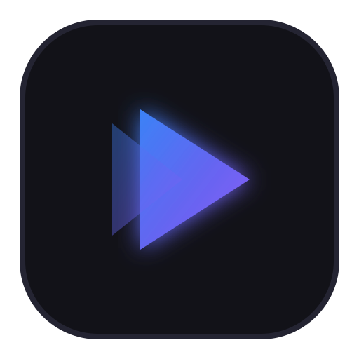

<div align="center">
  
  <h1>Velo</h1>
  <p><strong>Fast, lightweight, open-source desktop video player for macOS and Windows.</strong></p>
  <p>
    <a href="#features">Features</a> •
    <a href="#architecture">Architecture</a> •
    <a href="#tech-stack">Tech Stack</a> •
    <a href="#getting-started">Getting Started</a> •
    <a href="#keyboard-shortcuts">Keyboard Shortcuts</a> •
    <a href="#contributing">Contributing</a> •
    <a href="#license">License</a>
  </p>
</div>

---

## ⚡ Features

* 🚀 **Sub-500ms Cold Startup**: Instantaneous launch from process spawn to interactive UI.
* 🖥️ **Zero-Copy Native GPU Video Rendering**: Hardware-accelerated decoding directly to GPU surfaces via `libmpv` (`vo=gpu-next`, `VideoToolbox` on macOS, `D3D11VA` on Windows).
* 🎨 **Modern Minimalist UI**: Sleek glassmorphism overlay controls with auto-fading, smooth scrubbing, Dark/Light themes, and responsive design.
* 📦 **Broad Codec Compatibility**: Plays MP4, MKV, MOV, AVI, WebM, FLV, TS (H.264, HEVC/H.265, AV1, VP9, ProRes).
* 💬 **Advanced Subtitle Engine**: Pixel-perfect rendering for ASS/SSA styled subtitles via `libass`, plus SRT, VTT, and external subtitle drag-and-drop.
* 📑 **Integrated Playlist & Queue**: Folder scanning, drag reordering, loop modes (all/single), and shuffle.
* ⚙️ **Persistent Preferences & History**: Atomic JSON settings and playback resume timestamp persistence.

---

## 🏗️ Architecture

Velo uses a **Layered Hybrid Architecture**: a native GPU rendering surface sits beneath a transparent Tauri WebView overlay.

```
┌────────────────────────────────────────────────────────┐
│                   Vue 3 Overlay UI                     │
│  [TopBar]    [Timeline Slider]    [Floating Controls]  │
│  (CSS: background: transparent; backdrop-blur)         │
├────────────────────────────────────────────────────────┤
│                    Tauri IPC Layer                     │
│  Commands (Play, Seek, Volume)  Events (10Hz Position) │
├────────────────────────────────────────────────────────┤
│                  Rust Player Service                   │
│        (Dedicated Event Loop & Thread Safety)          │
├────────────────────────────────────────────────────────┤
│                     libmpv Engine                      │
│      FFmpeg Demux  •  VideoToolbox/D3D11VA  •  libass  │
├────────────────────────────────────────────────────────┤
│              Native GPU Rendering Surface              │
│       macOS: NSView / CALayer  •  Windows: Child HWND  │
└────────────────────────────────────────────────────────┘
```

---

## 🛠️ Tech Stack

* **Frontend**: Vue 3 (Composition API), TypeScript (Strict), Vite, Pinia, Tailwind CSS, Lucide Icons
* **Desktop Runtime**: Tauri v2, Rust
* **Video Engine**: `libmpv` (C API, `vo=gpu-next`)
* **Testing**: Vitest, Cargo test
* **Linting & Code Quality**: TypeScript strict, ESLint, Prettier, rustfmt, Clippy

---

## 🚀 Getting Started

### Download a build

Disk images for macOS are attached to each
[release](https://github.com/emozerorise/velo/releases). They carry their own
copy of libmpv, so nothing else needs installing.

They are **not signed with an Apple Developer certificate**, so macOS blocks
the first launch with "Apple could not verify Velo is free of malware." The
app is fine; macOS simply cannot tell who built it. To open it:

1. Drag **Velo** into Applications and double-click it.
2. When the warning appears, click **Done**.
3. Open **System Settings → Privacy & Security**, scroll to **Security**, and
   click **Open Anyway** next to the message about Velo.
4. Confirm with Touch ID or your password.

macOS remembers the choice, so this is only needed once. On macOS 15 and
later the older right-click → Open shortcut no longer works.

Prefer to skip all of that? Build from source below — locally built apps are
not quarantined.

### Prerequisites

* **Node.js**: v18+ (Node 20+ recommended)
* **Rust**: 1.75+ ([rustup.rs](https://rustup.rs))
* **libmpv & pkg-config**:
  * **macOS**: `brew install mpv pkg-config`
  * **Windows**: `libmpv-2.dll` and headers via Chocolatey or manual download

### Running in Development

```bash
# Clone the repository
git clone https://github.com/emozerorise/velo.git
cd velo

# Install dependencies
npm install

# Start development mode
npm run tauri dev
```

### Running Tests

```bash
# Run frontend unit tests
npm run test

# Run Rust backend unit tests
cargo test --manifest-path src-tauri/Cargo.toml
```

---

## ⌨️ Keyboard Shortcuts

| Shortcut | Action |
| :--- | :--- |
| `Space` | Play / Pause |
| `←` / `→` | Seek -5s / +5s |
| `Shift + ←` / `Shift + →` | Seek -30s / +30s |
| `↑` / `↓` | Volume +5% / -5% |
| `M` | Toggle Mute |
| `F` | Toggle Fullscreen |
| `[` / `]` | Decrease / Increase Playback Speed |
| `Cmd/Ctrl + O` | Open File Dialog |
| `Cmd/Ctrl + Shift + O` | Open Folder Dialog |

---

## 🤝 Contributing

Contributions are welcome! Please check out [CONTRIBUTING.md](CONTRIBUTING.md) for details on code style, testing, and pull request guidelines.

---

## 📜 License

This project is licensed under the [GNU General Public License v3.0 (GPL-3.0)](LICENSE) to comply with bundled `libmpv` and `FFmpeg` binary distribution requirements.
